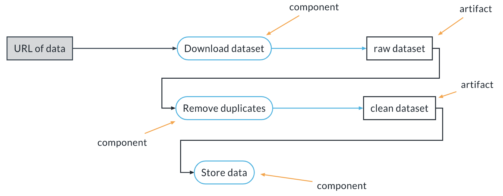
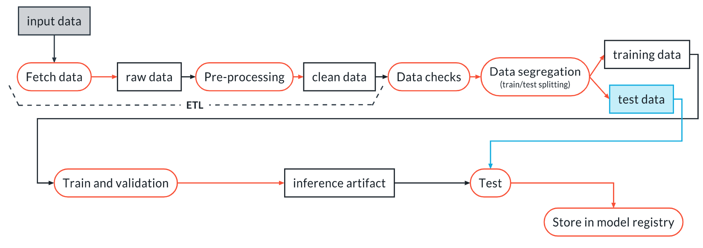
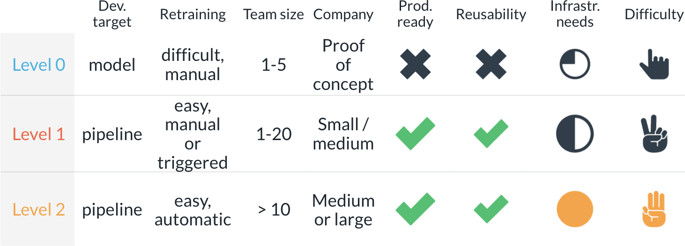

In this lesson, we concern ourselves with Machine Learning Pipelines, including:

* What is a ML pipeline and why it is useful 
* The three levels of MLops 
* A refresher on using argparse 
* Versioning data and artifacts with Weights and Biases 
* ML pipeline Components in MLflow 
* Linking together the components into a pipeline 
* Conda vs. Docker

# What is a Machine Learning Pipeline?

An Machine Learning pipeline is made of:

Components (or steps): independent, reusable and modular pieces of software that receive one or more inputs and produce one or more output. They can be scripts, notebooks or other executables.
Artifacts: the product of components. They can become the inputs of one or more subsequent components, thereby linking together the steps of the pipeline. Artifacts must be tracked and versioned.
This is an example of a simple ML pipeline (in this case, an ETL pipeline):



An ETL pipeline with components and artifacts
This pipeline starts from an URL containing some data, which is the input to the first component called Download_dataset. Such component outputs the artifact raw dataset, which then becomes the input to the second component called Remove duplicates that outputs the artifact clean dataset. Finally, clean dataset becomes the input to the last component called Store data which stores the data in the database.

Another example of a ML pipeline is the training pipeline, that looks typically like this:



A typical training pipeline - input, fetch data, raw data, pre-processing, clean data, data checks, data segregation, into training and test data, where training data goes to train and validation, inference artifact, and onto test (where it links with test data from earlier), and out to storage in the model registry.
In the remaining of the class we will go through each step of this pipeline and learn how to implement it, and then stitch everything together so it can be run at once.

# The Three Levels of MLops

## Why Use ML Pipelines: The 3 Levels of MLops

We will see now the 3 levels of MLops and their use. The basics of the classification is taken from this(opens in a new tab): https://cloud.google.com/architecture/mlops-continuous-delivery-and-automation-pipelines-in-machine-learning?hl=es-419 document by Google Cloud. We will be adding some context and several details to make clearer its application in practice.

### Level 0
This is the level where there is no MLops process. It is ok for personal projects, when learning something new, or for demos and MVPs. In all these cases the overhead of a proper MLops process might be sacrificed because of deadlines and time budget. The main features of this stage are:

* The code is monolithic - one or few scripts or Jupyter notebooks, with limited reusability  
* The target of the development is a model, and not a ML pipeline (we will see later what this means) 
* There is limited concern for production during development, hence the model needs to be reimplemented for production, maybe by a different team 
* No awareness of the need for model monitoring and retraining

### Level 1
As soon as you are past the proof of concept stage and you are targeting production, you should consider a more mature process, starting with level 1. These are its features:

* The target of the development is a ML pipeline that can produce a model at any time. This makes it easy to re-train on new data, for example. 
* The pipeline is made with reusable components 
* You are tracking code, artifacts and experiments for reproducibility and transparency 
* The output of the ML pipeline is an inference artifact that contains the pre-processing steps, so these do not need to be reimplemented for production (more on this later)
* The model is monitored in production

With respect to level 0, level 1 produces the following advantages:

* Process standardization 
* Rapid prototyping 
* Faster go-to-market with new products 
* Avoid model drift

### Level 2
This is the process for mature, large scale ML companies. Here we shift our focus from developing ML pipelines to improving the pipeline components. This assumes we already have several ML pipelines in production. The automation at this level is much higher, and we have processes for:

* Continuous integration: every time a component is changed integration tests are run to ensure that the component works as expected 
* Continuous deployment: each component passing the tests is automatically deployed and starts running as part of the ML pipelines in production 
* Continuous Training: when a component changes or when new data arrives the ML pipelines are triggered and new models are trained, tested and deployed automatically

With respect to level 1, level 2 features:

* Rapid iteration on prod pipelines and models
* Easy A/B testing of changes
* Easy collaboration and improvements across large teams
* Continuous improvements in production. The customer sees a continuously-improving product



# ArgParse and Logging

See logging_argparse.py

# Versioning Data and Artifacts

In Weights & Biases (and in many other tools) we have the following concepts:

* Run: the basic unit of computation, it usually corresponds to the execution of one script or of one Jupyter notebook, although multiple runs per script/notebook are possible. In W&B each run is assigned automatically a unique name (like `sunny-spring-21`), unless you force a specific name using the `name` keyword of `wandb.init` (we will only use automatic names in this class). You can attach to a run:
    * parameters
    * metrics 
    * artifacts 
    * images / plots

* Experiment: a group of one or more runs. For example, we can collect the execution of one entire pipeline into one experiment: each component will have its own run, but all the runs are grouped into one experiment. Experiments can be compared to each other in the W&B interface just like runs. All the metrics collected by all runs become metrics of the experiment. In W&B the experiment name is indicated by the optional `group` keyword of `wandb.init`. If you do not specify a group (i.e., an experiment name) the run will be ungrouped, i.e., will not belong to any experiment (but still belong to its project).
* Project: a heterogeneous collection of all runs, experiments, and artifacts related to a specific goal. A project collects all the work related to the same objective. W&B allows one to look at one project at a time.
* Artifact: any file or directory produced by our code during a run. Every artifact that is logged to a run is automatically versioned by W&B. For example, if two runs produce an artifact with the same name (say a file named `model.h5`) but the content of the file is different, W&B will generate two versions (for example v1 and v2). On the contrary, if two runs produce the exact same file (same name and same content), W&B will recognize this and will NOT generate a new version.

Optionally you can specify a `job_type` for each run. This is useful when visualizing your pipeline. Normally the `job_type` express the function of your script, for example `data_cleaning` or `preprocessing` or `model_training`.

When using W&B you can start a run in this way:
    
```python
import wandb

wandb.init(
    project="my_project",
    group="experiment_1",
    job_type="data_cleaning"
)
```

Actual version of the W&B does not have the `Graph View` option. You have to use the `Lineage` option.

# Demo: Versioning in Weights & Biases

See upload-and-version-artifacts.ipynb

## Supporting Materials
Weight and Biases (W&B) is a popular tool in the machine learning community for experiment tracking, visualization, and collaboration. Here are five external articles that provide valuable insights, tutorials, and case studies related to using W&B effectively:

1. "Introduction to Weights and Biases for Machine Learning Experiment Tracking"
This article provides a comprehensive introduction to W&B, covering its features, benefits, and how to integrate it into your machine learning workflow. It also includes examples and best practices for using W&B to track experiments and analyze results. ML Pipelines(opens in a new tab) https://towardsdatascience.com/introduction-to-weights-and-biases-for-machine-learning-experiment-tracking-ebb5eb6b7911

2. "Accelerate Your Machine Learning Workflow with Weights and Biases"
Learn how to leverage W&B to streamline your machine learning workflow, from model development to deployment. This article explores various W&B features such as experiment tracking, visualization, and collaboration tools, with practical examples and tips for maximizing productivity. Link to article(opens in a new tab) https://medium.com/analytics-vidhya/accelerate-your-machine-learning-workflow-with-weights-and-biases-9b286a8632d5

3. "Case Study: How Weights and Biases Revolutionized Our Deep Learning Projects"
Dive into a real-world case study showcasing the impact of W&B on deep learning projects. This article discusses how a team used W&B to improve model performance, optimize hyperparameters, and collaborate effectively, leading to significant productivity gains and better results. Deep Learning Projects on W&B(opens in a new tab) https://towardsdatascience.com/case-study-how-weights-and-biases-revolutionized-our-deep-learning-projects-6f93c7d3bca3

4. "Advanced Experiment Tracking with Weights and Biases"
Explore advanced techniques for experiment tracking using W&B, including hyperparameter optimization, distributed training, and custom metrics tracking. This article provides in-depth tutorials and code examples to help you harness the full potential of W&B for your machine learning projects. Experiment Tracking(opens in a new tab) https://blog.floydhub.com/advanced-experiment-tracking-with-weights-and-biases/

5. "Building a Deep Learning Dashboard with Weights and Biases"
Learn how to create interactive dashboards for visualizing and analyzing deep learning experiments using W&B. This article walks you through the process of building a custom dashboard to monitor model performance, compare experiments, and gain actionable insights from your data. Building a Deep Learning Dashboard(opens in a new tab) https://towardsdatascience.com/building-a-deep-learning-dashboard-with-weights-and-biases-989f8e4a6b11

These articles offer valuable resources for both beginners and experienced users looking to leverage W&B effectively in their machine learning projects. Whether you're just getting started with experiment tracking or seeking advanced techniques for optimization and collaboration, these articles provide insights and practical guidance to help you make the most of W&B.

# 