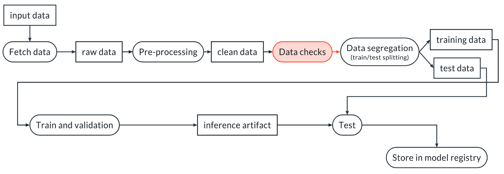

Welcome back! In this lesson, we are going to talk about data validation. Data validation is a very important step, especially in the context of MLops where we want to automate our ML pipelines. You want to avoid bad data getting into your ML pipeline, because you might get a model in output, but that model will not work as expected.

You will learn how to:

* Write tests with pytest, both deterministic and non-deterministic
* Use fixtures to share data between tests
* Use `conftest.py` to add options to the command line of pytest so you can pass parameters and use it within components of ML pipelines

# Why You Need Data Validation

We perform data validation in order to verify that our assumptions about the data are correct and stay correct even for new datasets. This latter point is not guaranteed. Indeed, the data can change for many reasons:

1. Bugs are introduced upstream (for example in ETL pipelines)
2. Changes in the source of the data are not communicated properly and produce unexpected changes in the input data 
3. The world changes and the distribution of the input data changes

Let's see some examples of the 3 cases:

1. Due to a bug in an upstream data ingestion pipeline, the target of a regression model went from units of million of dollars to just dollars, so what used to be 1 is now 1,000,000. This is likely to require a different preprocessing step, for example a scaling stage 
2. The review we were tracking went from a 3 stars to a 10 stars rating system, and we weren't alerted of the change 
3. Remote working is now more widespread, consequently people are willing to buy houses much farther from their workplace. A model that predicts price will have to take that into account, and probably a new model will be necessary.

There are two possible places for the data checks: before or after the data segregation (of course you can also have two stages, one before and one after segregation). There are pros and cons for these solutions, but for the remaining of the class we will place the checks before the segregation:



# Primer on Pytest

Pytest is a tool to execute tests. It is very powerful, but we will only cover the features we need for this class. Please refer to the documentation(opens in a new tab) https://docs.pytest.org/ for everything else.

Tests are collected in a directory, usually called `tests` and they are grouped into files. These files must have a name starting with `test_`, like `test_data.py` or `test_algorithm.py`.

Within each file you can have as many tests as you want. Each test is a function that again must start with `test_`. Within that function you can have one or more assertions, where you use the `assert` command to check that a condition is true. For example, say that we want to test that `a=b`. We can write:

```python
assert a==b, "The value of a is different than the value of b"
```

which is equivalent to:

```python
if not a==b:
  raise AssertionError("The value of a is different than the value of b")
```

Pytest will execute all the tests that it finds, and verify that all the assertions are true. If they are not, the corresponding test will fail.

An example of a test with `pytest` is then:

```python
def test_data_length(data):
  """
  Test that we have at least 1000 rows
  """
  assert len(data)>1000
```

But what is `data` in this case?

## Fixtures
In many cases tests need input data. This data can be provided using fixtures. Fixtures are special functions introduced by pytest. They must have the same name of the variable in the input of the test that they are supposed to fill. For example:

```python
import pytest
import wandb

run = wandb.init()

@pytest.fixture(scope="session")
def data():

    local_path = run.use_artifact("my_project/artifact").file()
    df = pd.read_csv(local_path, low_memory=False)

    return df


def test_data_length(data):
    """
    We test that we have enough data to continue
    """
    assert len(data) > 1000
```

Here the `data` function downloads and reads a dataframe, then returns it. The value returned by the `data` function becomes the `data` input variable in the test. In practice, pytest does something similar to:

```python
data_ = data()
test_data_length(data_)
```

The scope of the fixture can have a few legal values, described here(opens in a new tab) https://docs.pytest.org/en/6.2.x/fixture.html#fixture-scopes. We are going to consider only `session` and `function`: with the former, the fixture is executed only once in a pytest session and the value it returns is used for all the tests that need it; with the latter, every test function gets a fresh copy of the data. This is useful if the tests modify the input in a way that make the other tests fail, for example.

Let's see this more closely:

Let's consider this code:

```python
import pytest
import wandb
import pandas as pd

run = wandb.init()

@pytest.fixture(scope="session")
def data():

    local_path = run.use_artifact("exercise_5/preprocessed_data.csv:latest").file()
    df = pd.read_csv(local_path, low_memory=False)

    return df


def test_data_length(data):
    """
    We test that we have enough data to continue
    """
    assert len(data) > 1000


def test_number_of_columns(data):
    """
    We test that we have enough data to continue
    """
    assert data.shape[1] == 19
```

Using `scope="session"` like we are doing is roughly equivalent to calling the tests like:

```python
data_ = data()
test_data_length(data)
test_number_of_columns(data)
```

Instead, using `scope="function"` would mean:

```python
data_1 = data()
test_data_length(data_1)
data_2 = data() # Fresh copy
test_number_of_columns(data_2)
```

## Running the tests
If the tests are within the tests directory, we can run all the tests with:

```bash
> pytest tests/ -vv
```

The `-vv` option means verbose, and it yields a more pleasant visualization of the results.

# Deternimistic Tests

A data test is deterministic when it verifies attributes of the data that can be measured without uncertainty. Some examples are:

Number of columns in a dataset
Length of the dataset
Distinct values in a categorical variable
Legal range for a numerical variable (for example, length > 0)
...and many more!
