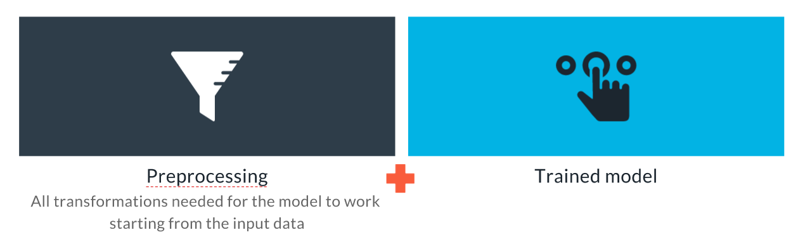
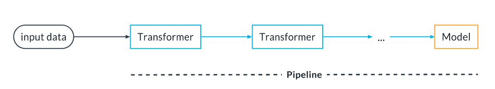
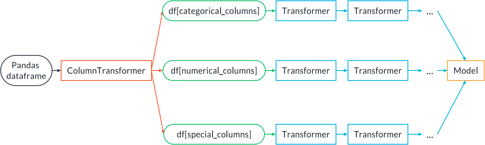

In this lesson we are going to see:

* What is an inference pipeline, and how to create one 
* How to conduct experiments in an ordered and reproducible way 
* How to test our final inference artifact 
* Options for deployment of our inference artifact

# The Inference Pipeline

We are going to talk now about the product of the train and validation step. Let's start with this definition:

* An inference pipeline is an ML pipeline that contains everything that needs to run in production at inference time: a pre-processing step that transforms the data input to the data expected by the model, and then the model. 
* An inference artifact is a serialized (i.e., saved to disk) static version of the inference pipeline containing the preprocessing as well as a trained model.

Using an inference pipeline and an inference artifact helps us achieve development/production symmetry because the code that executes the preprocessing during training is the same code that does the preprocessing in production.

So, summarizing, this is what an inference artifact looks like:



The inference artifact is constituted by a preprocessing step followed by our trained model, all together in one artifact

Sometimes the preprocessing stage includes some feature engineering. If the same feature engineering is shared across multiple models or is simply too computationally expensive to run in production, adopting a Feature Store would represent a good solution. See the earlier lesson on Data Exploration and Preparation for an introduction to the concept of Feature Stores.

# Write and Train an Inference Pipeline

An inference pipeline using scikit-learn looks like this:



It is a sequence of Transformers, which receive the input and transform it in some way, followed by a model that receives the transformed input and returns an output (a classification or a regression prediction). The term transformers here has nothing to do with the transformers widely used in NLP modeling. Instead, transformers are objects that transform the input data, for example by encoding categorical features or renormalizing numerical features.

The pipeline can be fitted in one go. Suppose we have a pipeline with two transformers, transformer A and transformer B, and then a model C. Sklearn will fit A, then use A to transform the input training data and use the result to train B. Then the data will be transformed by B and finally fed to the model C for training.

The pipeline can also be deployed as a whole. At inference time, the input data will go through A, then the result will go through B, and finally through C to get the final inference.

Let's see how to implement such a pipeline with sklearn. Let's assume transformer A is an imputer (to impute missing values), transformer B is a scaler and the model C is a Logistic Regression model:

```python
from sklearn.preprocessing import StandardScaler
from sklearn.impute import SimpleImputer
from sklearn.linear_model import LogisticRegression
from sklearn.pipeline import Pipeline, make_pipeline

pipe = Pipeline(
  steps=[
    ("imputer", SimpleImputer()),
    ("scaler", StandardScaler()),
    ("model", LogisticRegression())
  ]
)

# OR
pipe = make_pipeline(SimpleImputer(), StandardScaler(), LogisticRegression())
```

Now the pipeline can be fit at once with:

```python
pipe.fit(X_train, y_train)
```

and used for inference:

```python
pipe.predict(X_test)
pipe.predict_proba(X_test)
```

A pipeline can be a lot more complex than this, of course.

Sometimes we want to apply a different preprocessing to groups of columns in a dataframe. For that we can use the `ColumnTransformer` class in sklearn:



## Demo: ColumnTransformer

Here we use the `ColumnTransformer` to apply different preprocessing steps to numerical, textual and categorical columns:

```python
import pandas as pd
from sklearn.compose import ColumnTransformer
from sklearn.feature_extraction.text import TfidfVectorizer
from sklearn.preprocessing import StandardScaler, OneHotEncoder
from sklearn.impute import SimpleImputer
from sklearn.linear_model import LogisticRegression
from sklearn.pipeline import make_pipeline


# Example dataframe from the sklearn docs
df = pd.DataFrame(
    {'city': ['London', 'London', 'Paris', 'Sallisaw'],
     'title': ["His Last Bow", "How Watson Learned the Trick",
               "A Moveable Feast", "The Grapes of Wrath"],
     'expert_rating': [5, 3, 4, 5],
     'user_rating': [4, 5, 4, 3],
     'click': ['yes', 'no', 'no', 'yes']})
y = df.pop("click")
X = df

# Build a Column transformer
categorical_preproc = OneHotEncoder()
text_preproc = TfidfVectorizer()
numerical_preprocessing = make_pipeline(SimpleImputer(), StandardScaler())
preproc = ColumnTransformer(
    transformers=[
        ("cat_transform", categorical_preproc, ['city']),
        ("text_transform", text_preproc, 'title'),
        ("num_transform", numerical_preprocessing, ['expert_rating', 'user_rating'])
    ],
    remainder='drop'
)
pipe = make_pipeline(preproc, LogisticRegression())
pipe.fit(X, y)
```

## Inference Pipeline with PyTorch

The concept of inference pipeline is not limited to classical machine learning. It is useful also in deep learning and computer vision. All major deep learning frameworks offer a way to create pipelines that can include preprocessing steps as well as the model. Let's focus for example on `pytorch` - below, you'll see how we define an inference pipeline for a image classification task.

If you want to run this example, you can get the related files at the bottom of this page.

```python
import torch
from torchvision import transforms
from torch.nn import Sequential, Softmax
from PIL import Image
import numpy as np

# Get a pre-trained model
model = torch.hub.load('pytorch/vision:v0.9.0', 'resnet18', pretrained=True)
model.eval()

# Define the inference pipeline
pipe = Sequential(
    # NOTE: for the pipeline to be scriptable with script,
    # you must use a list [256, 256] instead of just one number (256)
    transforms.Resize([256, 256]),
    transforms.CenterCrop([224, 224]),
    transforms.Normalize(mean=[0.485, 0.456, 0.406], std=[0.229, 0.224, 0.225]),
    model,
    Softmax(1)
)

# Save inference artifact using torch.script
scripted = torch.jit.script(pipe)
scripted.save("inference_artifact.pt")

# NOTE: normally we would upload it to the artifact store

# Load inference artifact
pipe_reload = torch.jit.load("inference_artifact.pt")

# Load one example
# NOTE: these operations are usually taken care by the inference
# engine
img = Image.open("dog.jpg")
img.load()
# Make into a batch of 1 element
data = transforms.ToTensor()(np.asarray(img, dtype="uint8").copy()).unsqueeze(0)

# Perform inference
with torch.no_grad():
    logits = pipe_reload(data).detach()

proba = logits[0]

# Transform to class and print answer
with open("imagenet_classes.txt", "r") as f:
    classes = [s.strip() for s in f.readlines()]
print(f"Classification: {classes[proba.argmax()]}")
```

## Supporting materials
* transforms.py(opens in a new tab) https://video.udacity-data.com/topher/2021/June/60beab7f_transforms/transforms.py
* imagenet_classes.txt(opens in a new tab) https://video.udacity-data.com/topher/2021/June/60beab90_imagenet-classes/imagenet-classes.txt
* dog.jpg https://video.udacity-data.com/topher/2021/June/60beaba1_dog/dog.jpg