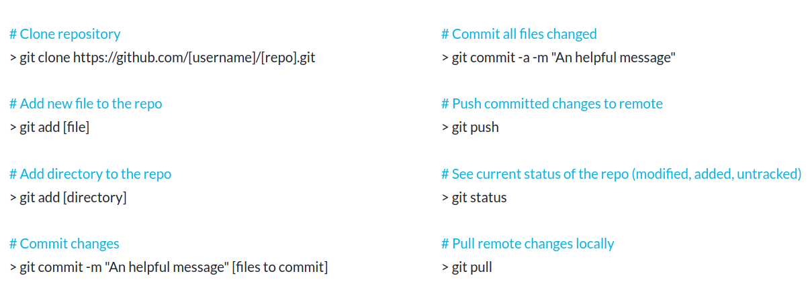
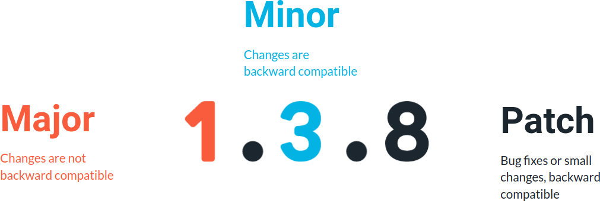

Welcome back! Let's bring together everything we learned and build an end-to-end ML pipeline. We are also going to see options for deploying our inference artifact.

You'll learn:

* How to bring everything together in a end-to-end ML pipeline 
* How to release the code in GitHub, and how to assign version numbers using Semantic Versioning 
* What is deployment, and how to deploy our inference artifact with MLflow and other tools for both online (real-time) and offline (batch) inference

# Release Basics

MLflow pipelines are code, and the code needs to be versioned. We have two options:

1. Collect all our pipeline, including the main script, its `conda.yml`, and its `MLproject` file as well as all the components with their `conda.yml`, their code and their `MLproject` files in the same repository. This is simple and good to start with.
2. Have separate repositories: one for the pipeline (the main script as well as the relative `conda.yml` and `MLProject`) and a separate one for the components. This promotes reusability and discoverability, because all the components of different pipelines are collected together in the same place where can be discovered, modified, released and versioned. This is what you need when you are scaling up and you have several ML pipelines. It is also a preliminary step for Level 2 MLops.

In this class we are going to use `git` to track our code. This is a cheatsheet you can use (or see the more extensive version here(opens in a new tab) https://about.gitlab.com/images/press/git-cheat-sheet.pdf):

# Release for Reproducibility

A release is a static copy of the code that reflects its state at a particular point in time. It has a version and a tag attached to it. The tag can be used to restore the repository (or a local copy of the code in the repository) to its state when the release is cut.

Semantic Versioning is a common schema for versioning release: a release is made of 3 numbers, like 1.3.8. The first number is called the major version. We only increment the major version when we make changes that break backward compatibility (i.e., a code running with the previous version is likely to break with the new version). The second number is called minor. We increment it when we make a significant change that is backward-compatible, i.e., code running with the previous version is not expected to break with the new one. And finally, we have a patch number. We increment it for bug fixes and small changes that do not significantly change the code's behavior (excluding the bugs fixed).

