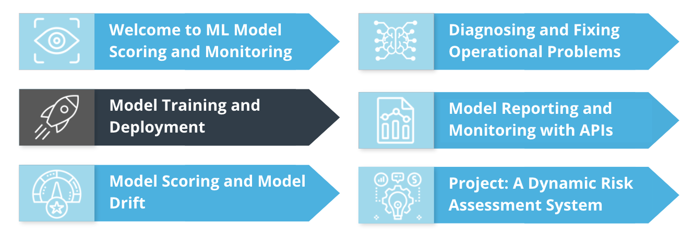
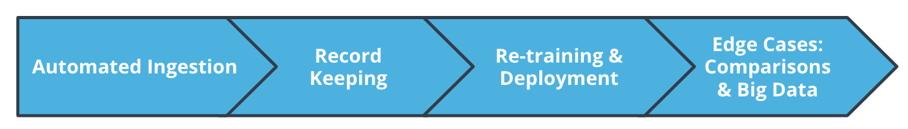
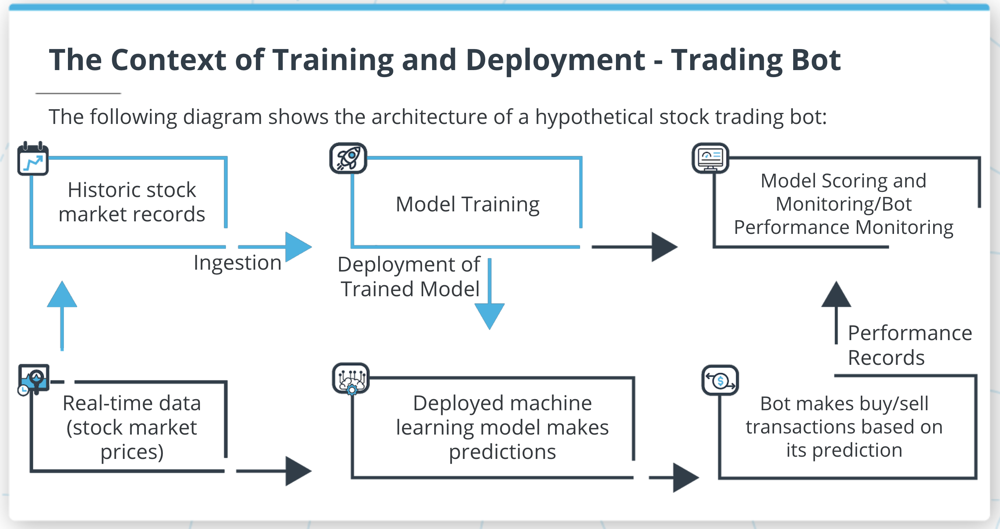
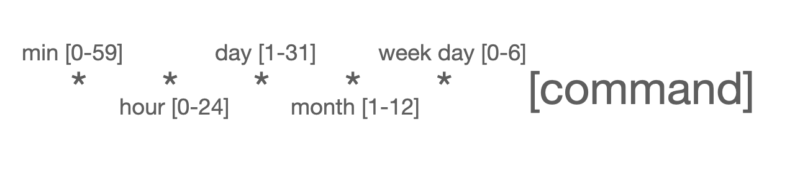

# Introduction and Lesson Overview


Course outline


Lesson outline

In this lesson, we'll focus on model training and deployment. We'll cover all of the following topics:

* Automated data ingestion: how to gather, compile, aggregate, clean, and output data for use in ML projects, including how to automate all processes
* Process record keeping: how to keep records of data ingestion and other ML project processes, and what to record
* Retraining and re-deployment: how to automatically retrain models and re-deploy them to production environments
* Advanced comparisons: how to make detailed comparisons between datasets, to determine observations that are shared in common or are duplicates
* Big data: how to work with extremely large datasets using distributed file systems and parallel processing

# Developing Your Intuition About Model Training and Deployment


a diagram showing the ingestion, training and deployment steps that we'll focus on in this lesson, together with the context in a hypothetical ML project

## Summary
To understand model training and deployment, consider a hypothetical ML project. In this project, we imagine a machine learning model that makes predictions about stock market data. A trading bot can use these predictions to make buy/sell transactions on the stock market.

To ensure this project runs well, you'll need to set up and maintain a few important operational components. The first thing you need to set up is data ingestion. You'll need data for making new predictions, and also for training and improving your model. Data ingestion will compile, clean, process, and output the data you need.

You'll also need to set up a process for model retraining and re-deployment. This is necessary to ensure that your model stays up-to-date and as accurate as possible.

You will also need to set up model scoring and monitoring.

In this lesson, we'll focus on data ingestion and model retraining and re-deployment. It's important to remember the steps described in the diagram above to understand the context of what we'll do in this lesson.

# Data Ingestion

## Summary
You need to ingest data in order to perform machine learning. Data ingestion is the term for the process of finding, gathering, recording, cleaning, and providing data as input to an ML project.

* First, you need to find data. Your data might be in several different places, in different formats, with different sizes and update frequencies.
* Next, you need to read your data into a Python script, and aggregate all source datasets into one, combined dataset.
* You need to do de-duplication and cleaning.
* Finally, you need to write the dataset to a single output file or table.
There are some methods from the os module that can be useful as you're performing data ingestion:

* os.getcwd() gets the current working directory, enabling you to search for files on your workspace.
* os.listdir() generates a list of filenames in a particular directory. This will help you know which files to read during your ingestion process.

## Demo: Data Ingestion

The demo starts by importing some useful modules:

```python
import os
import pandas as pd
```

Next, you can specify the directories where you will look for data:

```python
directories=['/udacity1/','/udacity2/']
```

You need to instantiate an empty data frame with the right column names:

```python
final_dataframe = pd.DataFrame(columns=['peratio','price'])
```

The heart of the demo is a for loop. It looks through all directories and finds all files in each directory. For every file it finds, it appends the file's data to the final_dataframe.

```python
for directory in directories:
    filenames = os.listdir(os.getcwd()+directory)
    for each_filename in filenames:
        currentdf = pd.read_csv(os.getcwd()+directory+each_filename)
        final_dataframe=final_dataframe.append(currentdf).reset_index(drop=True)
```

Finally, you can write the full data frame to your workspace:

## New Terms
* os: a module you can use to access workspace directories and files from a Python script
* ingestion: the process of finding, gathering, recording, cleaning, and providing data as input to an ML project.

## Additional Resources
You can find papers related to data ingestion here(opens in a new tab).


# Data Ingestion - Process Record Keeping

## Summary
As you're doing data ingestion, you should make sure to document the details of your process. The following are ingestion details you'll want to keep records of:

* The name and location of every file you read as a source.
* The date when you performed data ingestion.
* The datasets you worked with
* Other details about the data, maybe including how many duplicates you dealt with, and how many formatting changes you made.
* The name and location of the final output file you wrote.

## Demo
You can start the demo by importing the right modules:

```python
import pandas as pd
from datetime import datetime
```

Next, you need to specify the location of your source data, a file name, and an output location where you'll write your records:

```python
sourcelocation='./recorddatasource/'
filename='recordkeepingdemo.csv'
outputlocation='records.txt'
```

Next, you can read a csv at the location specified in the previously defined variables:

```python
data=pd.read_csv(sourcelocation+filename)
```

In order to record the time of the latest ingestion process, you need to get a current timestamp:

```python
dateTimeObj=datetime.now()
thetimenow=str(dateTimeObj.year)+ '/'+str(dateTimeObj.month)+ '/'+str(dateTimeObj.day)
```

You can compile all the relevant information into a single Python list:

```python
allrecords=[sourcelocation,filename,len(data.index),thetimenow]
```

Finally, you can write the records to a file on your workspace:

```python
MyFile=open(outputlocation,'w')
for element in allrecords:
     MyFile.write(str(element))
```

## New Terms
* timestamp: a character string recording a particular date and time
* datetime: a module containing capabilities for recording timestamps

## Additional Resources
You can read about outputting records in Python's official documentation here(opens in a new tab) https://docs.python.org/3/tutorial/inputoutput.html.

# Automation Using Cron Jobs

## Summary
It's very likely that you'll want to schedule Python scripts to run automatically at regular intervals. If you're using a Linux machine like your Udacity workspace, you can accomplish this using your machine's `crontab` file.

A crontab file contains rows of simple commands call cron jobs. Every cron job schedules a particular job or script to run at a particular regular interval. Cron jobs can run Python scripts, or any other command that can be run from the Linux command line.

Cron jobs are so important because they enable automation, and they reduce the manual intervention required in ML projects.

## Understanding cron jobs
You can run `crontab -e` on the Linux command line to open the crontab file that contains your machine's cron jobs.

Every cron job begins with five numbers or asterisks that specify how frequently the job should be run. Take a look at the illustration below:


The structure of a cron job: 5 numbers or asterisks representing the frequency of running, and the command to be run

Every cron job needs to specify how frequently the job should be run. If you specify an asterisk, the job will be run at every interval. After specifying the frequency, you need to specify the command to run. This will become more clear in the following demo.

## Demo: Cron Job

You can open your workspace and make sure that the cron service is running as follows:

```bash
service cron start
```

Next, you can open your machine's crontab:

```bash
crontab -e
```

After the crontab is open, you can add cron jobs to it. Each cron job is exactly one line long.

The following cron job will run every minute of every day:

```bash
 ***  * * python /home/workspace/L2/demo1/crondemo.py
```

The following cron job will run at 12:59 on January 5, just once per year:

```bash
59 12 5 1 * python /home/workspace/L2/demo1/crondemo.py
```

The following cron job will run on Fridays, once per hour at 59 minutes past every hour:

```bash
59  ***   5 python /home/workspace/L2/demo1/crondemo.py
```

## New Terms
crontab: the file on a Linux machine that contains cron jobs
cron job: a one-line code snippet that schedules a particular task

## Additional Resources
You can find a useful cron job editor here(opens in a new tab) https://crontab.guru/.
You can read more about cron jobs here(opens in a new tab) https://www.hostinger.com/tutorials/cron-job.